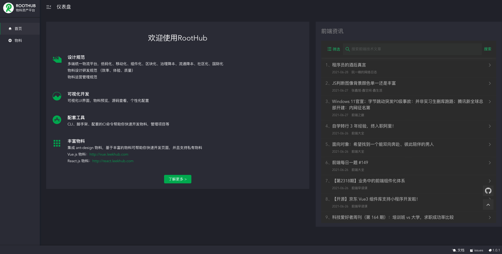
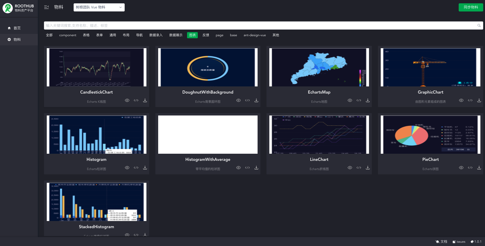
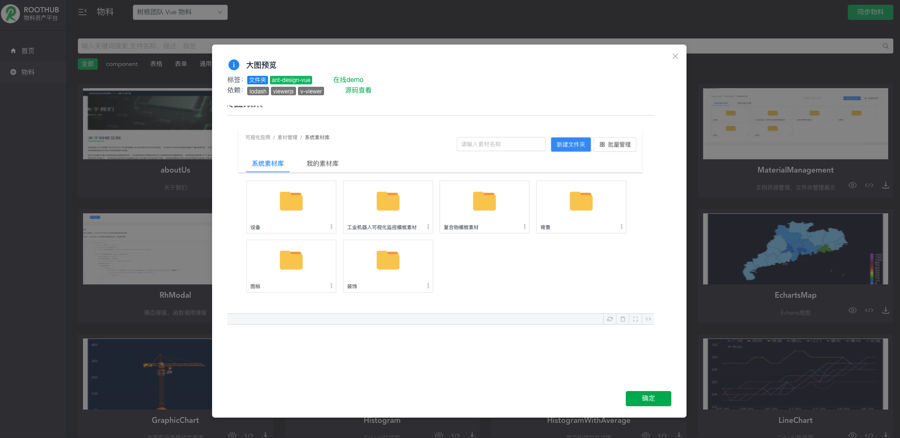

# RootHub

物料资产统一管理平台，http://roothub.leekhub.com

- [《物料库设计逻辑和思路》](https://roothome.yuque.com/docs/share/8818727b-bc31-42e8-96a9-627c5df4a241)
- [《material 命令行功能列表》](https://roothome.yuque.com/docs/share/6458c2ec-2536-4f89-8cdd-dc38bcb82077)

## 为什么?

- [《研发效能》](https://roothome.yuque.com/docs/share/0b91938d-dd32-4aae-8d82-4cba58527944)

- 大量页面同质化，重复开发浪费成本，复制黏贴麻烦。
- 一般公司前端人员配比不足以满足所有前端页面的开发工作，中后台页面开发一般交给后端人员，语言不熟悉，样式编写困难，开发一个表单页面花上 3 天，效率低。
- 个人的业务最佳实践方案没办法共享。

每个公司一般都会有自己的技术积累，自研的组件库，最佳开发实践等等，把这些积累集中起来，我们称之为物料，按照颗粒度划分，物料可以分为区块（页面的一部分或者完整的页面），组件（基础组件和业务组件），模板（包含基础功能的工程模板）。

## 功能特性

- 物料市场：
  - 集成 ant-design 物料
  - 自定义私有物料
  - 物料一键下载，告别繁琐
- 物料开发，私有物料集成
- 项目管理
- npm script 脚本运行
- 依赖管理
- 日志输出
- 框架无关

## 界面展示







## 使用

- yarn
- yarn dev
  - (windows 系统如果报错，分开执行以下命令)
  - yarn server
  - yarn ui

## License

_参考 [pandora](https://github.com/ideagay/pandora) （umi-ui）改造_

MIT

<!--
## 安装

```
yarn global add @roothome/roothub
```

安装完成之后, 执行 roothub -v 验证，如提示未找到命令，新开一个终端窗口重试

## 使用

注意：使用前请先配置 github 的 ssh key

```
#启动ui
roothub ui

#获得更多命令使用帮助
roothub -h
``` -->
