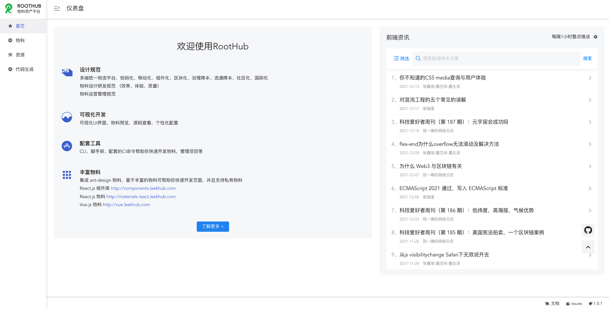
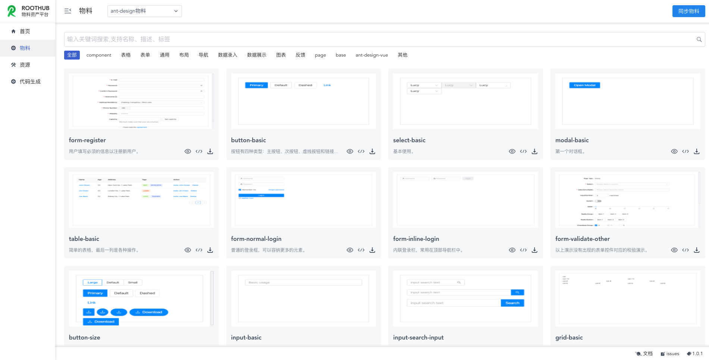
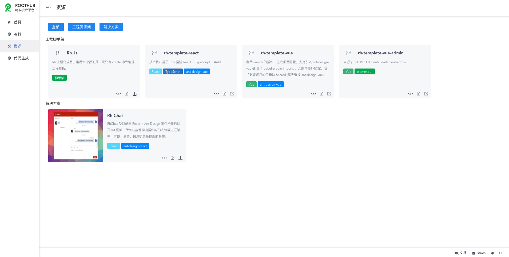

# RootHub

物料资产统一管理平台，在线体验：http://roothub.leekhub.com

- [《物料库设计逻辑和思路》](https://roothome.yuque.com/docs/share/8818727b-bc31-42e8-96a9-627c5df4a241)
- [《material 命令行功能列表》](https://roothome.yuque.com/docs/share/6458c2ec-2536-4f89-8cdd-dc38bcb82077)

## 项目意义

- 向[《研发效能》](https://roothome.yuque.com/docs/share/0b91938d-dd32-4aae-8d82-4cba58527944)迈向一大步
- 前端技术基建资产聚合管理

## 功能特性

- 物料市场：
  - 集成 ant-design 物料
  - 自定义私有物料
  - 物料一键下载，告别繁琐
- 物料开发，私有物料集成
- 技术基建资产管理
- 微前端（qiankun)集成子应用

## 界面展示

## 使用

> 将 config.sample.js 重命名为 `config.js`，修改里边自己的配置

- yarn
- yarn dev

## License

_参考 [pandora](https://github.com/ideagay/pandora) （umi-ui）改造_

MIT
